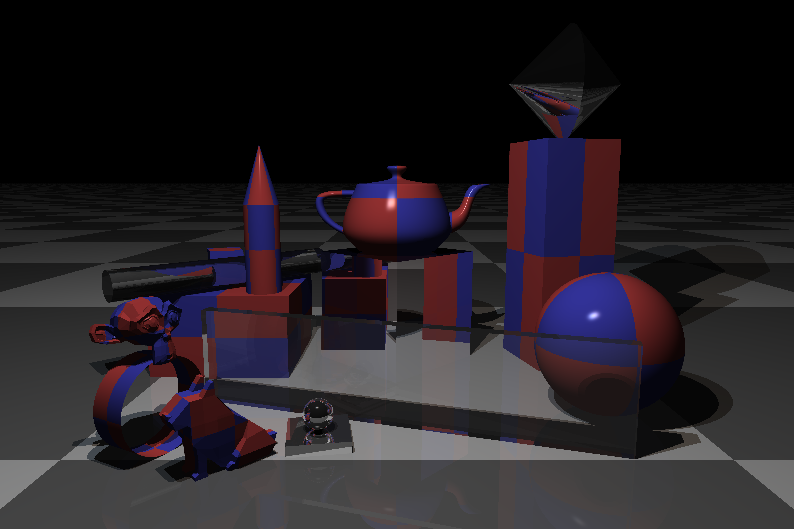

# jtracer

Ray Tracer Implementation Based on The Ray Tracer Challenge by Jamis Buck

Currently, it can produce scenes like this:




## Building

Use zig 11.0.

```
git submodule update --init
zig build run -Drelease=true
```
